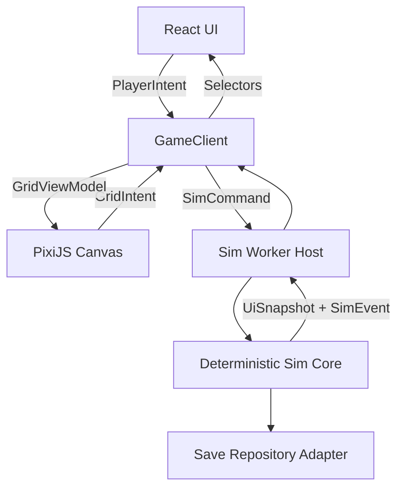

# OVERCLOCK

## Technical Design Document pentru Vertical Slice 0.1

Versiune: 1.0

Data: 15 august 2026

Status: Ready for implementation

Public: dezvoltatorul proiectului și Codex

Document asociat: `docs/GDD.md`, versiunea 1.1

## 1. Scopul documentului

Acest TDD definește implementarea tehnică a vertical slice-ului OVERCLOCK. El stabilește contractele dintre simulator, React, PixiJS, fișierele de conținut și sistemul de salvare.

Documentul nu redefinește viziunea jocului. GDD-ul rămâne sursa pentru experiența jucătorului. TDD-ul transformă acea experiență în limite, tipuri și criterii verificabile.

## 2. Rezultatul urmărit

Vertical slice-ul trebuie să ofere o sesiune completă de 45 până la 75 de minute. Jucătorul pornește în 1946 cu Human Computers, construiește un sistem cu tuburi electronice, rezolvă bottleneck-uri, folosește overclock și cooling, salvează un blueprint, trece două benchmark-uri și deblochează reveal-ul tranzistorului.

Produsul final al acestui TDD trebuie să ruleze:

1. în browser desktop, ca build static pentru itch.io;
2. local, prin serverul de dezvoltare Vite;
3. în testele headless, fără React sau PixiJS;
4. ulterior, fără schimbarea simulatorului, într-o aplicație Tauri 2.

## 3. Scope obligatoriu

Vertical slice 0.1 include:

- perioada 1946 până în 1948;
- tutorial Human Computers;
- un singur Facility Canvas;
- o singură generație jucabilă, Vacuum Tube System;
- 12 definiții de module;
- 8 definiții de task;
- 10 noduri de research;
- maximum două task-uri active;
- profiluri Eco, Balanced, Boost și Manual;
- power, temperatură locală și globală, throttling și emergency shutdown;
- heatmap controlabil;
- Design Mode cu preview, undo, redo, Apply și Cancel;
- un blueprint de subansamblu, cu instanțiere;
- Peak Throughput Benchmark;
- Sustained Stability Benchmark;
- save, autosave, load, export, import și o migrare demonstrativă;
- localizare română și engleză;
- tutorial de aproximativ 10 minute;
- Museum snapshot final;
- Reduced Effects;
- instrumente minime de debug și playtest report.

## 4. Out of scope

Nu implementăm în vertical slice:

- generația tranzistorului ca gameplay;
- alte facilități sau nivelul Portfolio;
- prebuild rack-uri;
- companie publică, acțiuni sau investitori;
- bankruptcy complet;
- automation IF/THEN;
- component health și distrugere permanentă;
- routing lichid sau immersion cooling;
- Boundary Reset, Fundamental Insights și Singularity Data;
- full Museum, Encyclopedia completă sau întreaga cronologie;
- user accounts, cloud saves, analytics extern sau leaderboards online;
- mobile, touch sau controller;
- Tauri în primele patru faze;
- artă finală pentru fiecare componentă.

## 5. Principii tehnice

### 5.1 Simulator autoritativ

Simulatorul reprezintă singura sursă de adevăr pentru economie, grid, task-uri, research, temperatură și progres. React și PixiJS pot păstra doar stare de prezentare, selecție și input temporar.

### 5.2 Determinism

Același `seed`, același conținut și aceeași succesiune ordonată de comenzi trebuie să producă același hash de state după același număr de tick-uri.

Simulatorul nu folosește:

- `Math.random()`;
- `Date.now()`;
- `performance.now()` pentru gameplay;
- numărul de frame-uri randate;
- ordinea instabilă a proprietăților unui obiect;
- operații dependente de locale.

### 5.3 Date serializabile

State-ul autoritativ folosește obiecte, array-uri, string-uri, numere, valori booleene și `null`. Timpul se stochează în tick-uri sau milisecunde întregi de simulare. Datele calendaristice din metadate se stochează ca string ISO în envelope, nu în state-ul care decide gameplayul.

### 5.4 Explainability

Fiecare valoare importantă trebuie să poată explica formula care a produs-o. UI-ul nu recalculează Useful Compute. Simulatorul emite `ComputeBreakdown` cu factorii folosiți.

### 5.5 Scope control

Implementăm cea mai simplă structură care susține vertical slice-ul și extensiile deja certe. Nu construim framework-uri generale pentru sisteme viitoare care nu au consumator în versiunea 0.1.

## 6. Stack și versiuni

Faza 0 trebuie să fixeze versiuni exacte în lockfile.

| Strat | Alegere |
|---|---|
| Limbaj | TypeScript cu `strict: true` |
| Build | Vite |
| UI | React |
| Canvas | PixiJS 8 |
| Grafice | uPlot |
| Validare | Zod |
| Localizare | i18next și react-i18next |
| Teste | Vitest și Playwright |
| Package manager | pnpm |
| Persistență browser | IndexedDB printr-un adapter propriu mic |
| Desktop ulterior | Tauri 2 |

Nu adăugăm o bibliotecă globală de state în Faza 0. `GameClientStore` folosește `useSyncExternalStore`. Putem evalua o bibliotecă numai dacă profiling-ul sau complexitatea reală justifică schimbarea.

## 7. Arhitectura runtime



### 7.1 Sim Core

`SimCore` este o clasă orchestration foarte mică peste funcții pure. Ea deține state-ul, coada de comenzi, RNG-ul și ordinea sistemelor. Nu importă cod din `app`, `ui`, `rendering` sau browser.

API minim:

```ts
export interface SimCore {
  readonly tick: number;
  enqueue(command: SimCommand): CommandReceipt;
  step(ticks?: number): StepResult;
  getStateForSave(): GameState;
  getUiSnapshot(): UiSnapshot;
  drainEvents(): SimEvent[];
}
```

### 7.2 Sim Worker Host

În producție, simulatorul rulează într-un Web Worker. Host-ul:

- primește comenzi serializabile;
- menține accumulator-ul pentru fixed ticks;
- rulează maximum un număr controlat de catch-up ticks per frame de host;
- trimite snapshot-uri UI la maximum 10 Hz;
- trimite alertele critice imediat după tick;
- acceptă pause, viteze 1x, 2x și 4x;
- oprește catch-up-ul când tab-ul revine după o suspendare lungă și delegă progresul către Offline Assist.

Testele folosesc `SimCore` direct. Node nu trebuie să emuleze Worker-ul pentru testele de formule și determinism.

### 7.3 GameClient

`GameClient` este singurul API folosit de UI pentru gameplay:

```ts
export interface GameClient {
  dispatch(command: SimCommand): Promise<CommandResult>;
  getSnapshot(): UiSnapshot;
  subscribe(listener: () => void): () => void;
  subscribeEvents(listener: (event: SimEvent) => void): () => void;
  getGridViewModel(): GridViewModel;
  requestSave(reason: SaveReason): Promise<SaveMetadata>;
}
```

UI-ul poate avea servicii separate pentru setări, localizare și dialoguri. Ele nu modifică direct simulatorul.

### 7.4 React

React controlează:

- Header;
- Left Rail;
- Bottom Build Tray;
- Right Operations Stack;
- Telemetry;
- task-uri, research, Museum și settings;
- dialoguri de confirmare;
- text și accesibilitate;
- shortcut-uri globale care nu depind de coordonate canvas.

React citește snapshot-uri prin selectori cu equality checks. O schimbare a unui tile nu trebuie să re-randeze întregul dashboard.

### 7.5 PixiJS

PixiJS controlează:

- tile grid și camera;
- module și placement ghosts;
- selecție și selection box;
- power/data routes;
- heatmap;
- pulse-uri și particule;
- highlights pentru Diagnostic Pulse;
- zoom, pan și transformarea coordonatelor.

PixiJS emite `GridIntent`. Bridge-ul îl transformă în comenzi. Renderer-ul nu importă reducers sau mutatori ai simulatorului.

## 8. Structura repository-ului

```text
src/
  app/
    bootstrap/
    game-client/
    worker/
  sim/
    core/
    commands/
    events/
    systems/
    formulas/
    selectors/
    rng/
    replay/
  content/
    loader/
    schemas/
    raw/
  grid/
    domain/
    validation/
    routing/
    thermal/
    blueprints/
  rendering/
    pixi/
    heatmap/
    effects/
  ui/
    layout/
    panels/
    workspaces/
    charts/
    dialogs/
  save/
    repository/
    migrations/
    export/
  localization/
  audio/
  devtools/
tests/
  unit/
  integration/
  determinism/
  performance/
  e2e/
public/
  assets/
docs/
```

Fișierele din `contracts/src/` ale acestui pachet sunt contracte de pornire. În Faza 0, Codex le mută în folderele potrivite, păstrând semantica și testele de tip.

## 9. Unități și convenții

| Concept | Reprezentare |
|---|---|
| Tick | integer, 100 ms de simulare |
| Compute | FLOPS |
| Work | număr de operații |
| Power | watts |
| Energy cost | USD per kWh în conținut |
| Temperature | grade Celsius |
| Memory capacity | bytes |
| Bandwidth | bytes per second |
| Latency | microseconds |
| Cash | USD, `number` autoritativ cuantizat la 6 zecimale prin microdolari |
| Grid position | coordonate integer `x`, `y` |
| Rotation | 0, 90, 180 sau 270 |
| Ratio/factor | număr finit, documentat și limitat |

Simulatorul păstrează câmpurile monetare publice ca `number`, dar execută mutațiile monetare autoritative prin aritmetică internă în microdolari, unde 1 USD = 1.000.000 microdolari. La granițele monetare, valorile se cuantizează la 6 zecimale USD cu rotunjire la jumătate în sensul îndepărtării de zero (`round-half-away-from-zero`). UI-ul afișează de regulă Cash cu 2 zecimale, iar statisticile extinse pot expune valori sub-cent. Formatarea UI rămâne separată și nu reintră niciodată în simulator. Precizia autoritativă sub-cent este necesară pentru costurile deterministe de energie; de exemplu, 24.000 W timp de 0,1 secunde la 0,042 USD/kWh costă 0,000028 USD.

## 10. State-ul autoritativ

Forma exactă inițială se află în `contracts/src/types.ts`. State-ul principal conține:

```ts
export interface GameState {
  saveVersion: number;
  contentVersion: string;
  seed: string;
  tick: number;
  rngState: number;
  clock: SimulationClockState;
  campaign: CampaignState;
  economy: EconomyState;
  facility: FacilityState;
  inventory: InventoryState;
  tasks: TaskSystemState;
  research: ResearchState;
  benchmarks: BenchmarkState;
  blueprints: BlueprintState;
  tutorial: TutorialState;
  museum: MuseumState;
  achievements: AchievementState;
}
```

Setările grafice, volumele audio și limba se salvează separat de state-ul determinist. Ele pot apărea în `SavePayload.settings`, dar nu influențează hash-ul de replay.

`FacilityState` include câmpul autoritativ aditiv:

```ts
nextModuleInstanceSequence: number;
nextRouteSequence: number;
power: FacilityPowerState;
```

Valoarea pornește de la `1`, rămâne un positive safe integer și nu scade. Fiecare placement acceptat alocă `module-instance-` urmat de secvența zecimală pe minimum opt poziții cu zero-uri la stânga, apoi incrementează secvența exact o dată. Un placement respins nu consumă secvența. Remove și Cancel nu restaurează valori consumate, astfel încât ID-urile instanțelor nu se refolosesc în același save. Alocarea nu consumă RNG. Coliziunea unui ID generat sau imposibilitatea incrementării în intervalul safe integer produce `INVALID_SYSTEM` fără mutație. Formatul și secvența fac parte din compatibilitatea save/replay.

`nextRouteSequence` are aceeași semnificație de compatibilitate save/replay pentru rute: pornește la
`1`, rămâne positive safe integer și nu scade. Fiecare `CONNECT_PORTS` acceptat alocă
`route-00000001` (minimum opt cifre zecimale cu zero-uri la stânga) și incrementează secvența exact
o dată. Respingerea, Disconnect, Cancel și viitorul Undo nu restaurează secvența; golurile sunt
intenționate. Coliziunea ID-ului generat sau overflow-ul produce `INVALID_SYSTEM` fără mutație și nu
consumă RNG.

`FacilityPowerState` este un contract autoritativ aditiv, serializabil:

```ts
interface FacilityPowerState {
  layoutRevision: number | null;
  totalRequestedPowerWatts: number;
  totalDeliveredPowerWatts: number;
  headroomWatts: number;
  energyCostUsdThisTick: number;
  byModule: Record<ModuleInstanceId, ModulePowerDeliveryState>;
  byRoute: Record<RouteId, RoutePowerDeliveryState>;
}
```

`layoutRevision: null` marchează o stare dirty neevaluată: recordurile sunt goale, requested,
delivered și cost sunt zero, iar headroom este capacitatea contractată. După calcul, revizia este
`facility.liveLayoutRevision`, `byModule` acoperă exact modulele live, iar `byRoute` acoperă exact
rutele live de power. Un Apply care înlocuiește layout-ul resetează starea la dirty; calculul are loc
numai la următorul tick real.

### 10.1 Invariante globale

- `tick` nu scade.
- Cash nu devine `NaN` sau infinit.
- O instanță de modul ocupă exact footprint-ul rotit declarat.
- Două module nu ocupă același tile.
- Un modul activ are power path valid.
- Task-urile active nu depășesc sloturile deblocate.
- Research-ul completat nu poate reveni la `locked`.
- Temperatura fiecărui tile rămâne între limitele de siguranță numerică ale simulării.
- Un command respins nu schimbă hash-ul state-ului.
- ID-urile instanțelor nu se refolosesc în același save.
- ID-urile rutelor nu se refolosesc în același save.

## 11. Comenzi

Toate acțiunile care schimbă gameplayul folosesc `SimCommand`. Comanda conține:

- `commandId`, UUID generat în client;
- `kind`, discriminator stabil;
- `expectedTick`, opțional, pentru acțiuni care trebuie respinse dacă snapshot-ul este prea vechi;
- payload specific;
- `source`, pentru input, tutorial, debug sau replay.

Comenzile intră în coadă și se aplică în ordine la începutul următorului tick. Comenzile de pause și speed sunt procesate de host, deoarece controlează programarea tick-urilor, dar sunt logate în replay.

### 11.1 Lista vertical slice-ului

| Domeniu | Comenzi |
|---|---|
| Clock | `SET_PAUSED`, `SET_SPEED` |
| Build | `ENTER_DESIGN_MODE`, `PLACE_MODULE`, `MOVE_MODULE`, `ROTATE_MODULE`, `REMOVE_MODULE`, `CONNECT_PORTS`, `DISCONNECT_ROUTE`, `UNDO_DESIGN`, `REDO_DESIGN`, `APPLY_DESIGN`, `CANCEL_DESIGN` |
| Inventory | `BUY_MODULE`, `SELL_INVENTORY_ITEM` |
| Task | `ACCEPT_TASK`, `ALLOCATE_TASK`, `SET_TASK_HOLD`, `ABANDON_TASK` |
| Overclock | `SET_OVERCLOCK_PROFILE`, `SET_MANUAL_OVERCLOCK` |
| Research | `START_RESEARCH`, `CANCEL_RESEARCH` |
| Blueprint | `SAVE_BLUEPRINT`, `INSTANTIATE_BLUEPRINT`, `RENAME_BLUEPRINT` |
| Benchmark | `START_BENCHMARK`, `CANCEL_BENCHMARK` |
| Tutorial | `ACKNOWLEDGE_TUTORIAL_STEP`, `SET_GUIDANCE_MODE` |
| Diagnostics | `TRIGGER_DIAGNOSTIC_PULSE` |
| Debug | comenzi incluse doar în build-urile de dezvoltare |

### 11.2 Atomicitate

Validarea se execută înainte de mutație. Pentru operații complexe, simulatorul calculează un patch într-un draft intern, validează invariantele și îl comite complet.

Exemple de respingere:

- cash insuficient;
- research lipsă;
- footprint în afara grilei;
- coliziune;
- port incompatibil;
- blueprint cu module blocate;
- benchmark pornit fără configurație validă;
- task allocation către un cluster oprit;
- profil Manual în afara limitelor.

Codurile de respingere sunt stabile și localizate în UI. Mesajele umane nu se stochează în simulator.

## 12. Evenimente

Un eveniment descrie un fapt deja produs. Evenimentele includ `eventId`, `tick`, `kind`, `severity` și payload. Ele pot alimenta notificări, audio, tutorial, achievements și event log.

Evenimente obligatorii:

```text
COMMAND_REJECTED
DESIGN_APPLIED
MODULE_PURCHASED
MODULE_SHUTDOWN
THERMAL_WARNING_ENTERED
THERMAL_WARNING_CLEARED
TASK_ACCEPTED
TASK_PHASE_COMPLETED
TASK_COMPLETED
TASK_DEADLINE_AT_RISK
TASK_FAILED
RESEARCH_STARTED
RESEARCH_COMPLETED
BLUEPRINT_SAVED
BLUEPRINT_INSTANTIATED
BENCHMARK_STARTED
BENCHMARK_COMPLETED
BENCHMARK_FAILED
TUTORIAL_STEP_COMPLETED
ACHIEVEMENT_UNLOCKED
MUSEUM_SNAPSHOT_CREATED
TRANSISTOR_REVEALED
AUTOSAVE_REQUESTED
```

Event bus-ul nu păstrează progresul. Dacă UI ratează un eveniment, următorul snapshot trebuie să conțină starea corectă.

## 13. Ordinea unui tick

Durata fixă este `0.1` secunde de simulare.

Ordinea nu se schimbă fără ADR și actualizarea testelor de determinism:

1. preia și ordonează comenzile;
2. validează și aplică comenzile;
3. reconstruiește conectivitatea dirty;
4. calculează power demand și power delivery;
5. calculează workload allocation;
6. calculează heat generation;
7. actualizează temperaturile locale și limita globală;
8. aplică throttling, stability și shutdown;
9. calculează Theoretical și Useful Compute;
10. avansează task-uri și benchmark-uri;
11. avansează research;
12. aplică venituri, energie și costuri operaționale;
13. actualizează tutorial, achievements și campania;
14. emite evenimente;
15. generează datele dirty pentru snapshot.

Economia care depinde de compute folosește compute-ul rezultat în tick-ul curent. Costul de energie folosește consumul mediu din tick-ul curent.

## 14. Timp, pause și speed

Host-ul acceptă `1x`, `2x` și `4x`. Pause oprește tick-urile, dar permite navigarea, Design Mode și comenzi care nu cer avansarea timpului.

La `4x`, host-ul rulează patru tick-uri pentru fiecare interval real echivalent. Nu mărește `dt` și nu sare peste sisteme.

Catch-up-ul maxim într-un burst este 20 de tick-uri. Dacă tab-ul este suspendat mai mult, host-ul nu încearcă să simuleze toate tick-urile pe main thread. El creează un request separat de Offline Assist după revenire.

Modul debug poate folosi viteze mai mari sau `simulate N`, dar rulează aceeași funcție `step`.

## 15. RNG și replay

Vertical slice-ul folosește un generator determinist simplu și bine testat, de exemplu Mulberry32 sau PCG32. Algoritmul și conversia seed-ului nu se schimbă după publicarea unui save fără migrare.

Replay-ul minimal stochează:

```ts
interface ReplayLog {
  replayVersion: 1;
  seed: string;
  contentVersion: string;
  initialStateHash: string;
  commands: Array<{ tick: number; sequence: number; command: SimCommand }>;
  checkpoints: Array<{ tick: number; stateHash: string }>;
}
```

Testul principal rulează același replay de două ori și compară checkpoint-urile. Hash-ul folosește o serializare canonică, cu chei ordonate și fără setări de prezentare.

## 16. Formula Useful Compute

Formula centrală este:

```text
Useful Compute = Theoretical Compute
               × Power Factor
               × Thermal Factor
               × Memory Factor
               × Interconnect Factor
               × Suitability
               × Stability Factor
```

`ComputeBreakdown` păstrează fiecare factor și pierderea absolută asociată. Factorii operaționali standard se limitează între `0` și `1`. `Suitability` poate varia în vertical slice între `0.70` și `1.25`.

### 16.1 Theoretical Compute

```text
module theoretical compute = base compute
                            × bin compute ratio
                            × requested frequency ratio
                            × operational ratio
task theoretical compute = requested share
                         × stable sum of selected module theoretical compute
```

Operational ratio is exactly one only when the post-Power module is online, delivered Power reaches
minimum, and the current Power generation represents load (`requestedPowerWatts > minimumPowerWatts`).
It is zero for startup, brownout, shutdown, and idle-only generation. The tick that completes startup
still produces zero; the following full-load tick may produce compute.

### 16.2 Power Factor

```text
Power Factor = min(1, delivered power / requested power)
```

Power allocation urmează prioritățile: safety și cooling, memory și control, compute, I/O. Dacă livrarea scade sub minimum-ul unui modul, acesta intră în brownout și nu produce compute.

### 16.3 Thermal Factor

Fiecare modul definește `normalMaxC`, `warningMaxC`, `criticalMaxC` și `shutdownC`.

```text
temperature <= normalMaxC       factor = 1.00
normalMaxC .. warningMaxC       factor = lerp(1.00, 0.96)
warningMaxC .. criticalMaxC     factor = lerp(0.96, 0.65)
criticalMaxC .. shutdownC       factor = lerp(0.65, 0.10)
temperature >= shutdownC        factor = 0.00 și shutdown
```

Aggregate Power is weighted by allocated theoretical compute. Aggregate Thermal is weighted by the
post-Power contribution. Aggregate retry and invalid-sample rates are weighted by post-Power,
post-Thermal compute.

### 16.4 Memory Factor

Memory capacity remains a fixed working-set requirement and is not share-scaled. Required bandwidth
is scaled by requested share. Insufficient minimum capacity adds `insufficient-memory-capacity` and
makes Memory Factor zero.

```text
capacity factor = 0, when available capacity < minimum capacity
capacity factor = 1, when recommended capacity = 0
capacity factor = min(1, available capacity / recommended capacity), otherwise
bandwidth factor = 1, when share-scaled required bandwidth = 0
bandwidth factor = clamp(available bandwidth / share-scaled required bandwidth, 0.25, 1), otherwise
Memory Factor = min(capacity factor, bandwidth factor)
```

### 16.5 Interconnect Factor

Topology uses only explicit authoritative data routes in stable ID order; it never constructs an
adjacent-port graph. Canonical route direction is preserved, except data-bidirectional endpoints work
in both directions. For every route:

```text
grid steps = max(1, route path points - 1)
route latency = grid steps × data-route latency per grid step
effective route capacity = capacity per second × (1 - congestion ratio)
```

Every contributing compute module must have directed read and write access to a common powered memory
provider set; local memory is a zero-route path. Shortest directed paths determine latency, widest
directed paths determine delivered bandwidth. Each module selects its best eligible provider, then
cluster latency is the worst selected latency and cluster bandwidth is the minimum selected
bidirectional bandwidth. Disconnection adds `data-disconnected` and produces exactly zero.

```text
extra latency = max(0, cluster latency - data-route latency per grid step)
latency penalty = clamp(extra latency / phase latency tolerance, 0, 0.35)
congestion penalty = 0, when share-scaled requested bandwidth = 0
congestion penalty = clamp(1 - delivered route bandwidth / share-scaled requested bandwidth, 0, 0.45), otherwise
Interconnect Factor = clamp(1 - latency penalty - congestion penalty, 0.20, 1)
```

### 16.6 Suitability

Only current-phase tags map directly: `serial` to serial, `parallel` and `vector` to parallel,
`memory-heavy` to memory, `bandwidth` to bandwidth, and `latency` to latency. For every mapped axis,
the score is the maximum content suitability among powered usable cluster modules in the task's
bidirectionally usable data component, including usable non-compute members, clamped to
`[0.70, 1.25]`. Suitability is the arithmetic mean
of required axis scores clamped to the same range; with no mapped axis it is exactly one. Boost affects
theoretical compute through frequency and has no second suitability bonus.

### 16.7 Stability Factor

```text
Stability Factor = 1 - retry rate - invalid sample rate
```

Task 9 exposes whether the phase stability minimum is met. Falling below it adds
`stability-below-minimum` as a warning but adds no multiplier or Task 9 progress/acceptance decision.

`ComputeBreakdown` multiplies the stored factors in fixed order. For every factor below one,
`lostComputeFlops` is the value before the factor minus the value after it. Suitability above one is a
boost, not a bottleneck. Bottlenecks sort by descending loss with fixed factor order as tie-breaker.

## 17. Overclock

Preset-urile inițiale sunt data-driven:

| Profil | Frequency ratio | Voltage ratio | Rol |
|---|---:|---:|---|
| Eco | 0.80 | 0.90 | eficiență și temperatură |
| Balanced | 1.00 | 1.00 | operare nominală |
| Boost | 1.25 | 1.10 | performanță temporară |
| Manual | 0.65 până la 1.40 | 0.85 până la 1.20 | reglaj avansat |

Puterea dinamică folosește:

```text
Dynamic Power Factor = voltage ratio² × frequency ratio
```

Heat generation folosește puterea dinamică și eficiența termică a modulului.

Stabilitatea pornește de la binning-ul instanței, voltage headroom și temperatură. Boost trebuie să fie sigur pentru perioade scurte într-un sistem răcit corect, dar riscant în Sustained Benchmark fără headroom.

Schimbarea profilului se aplică la nivel de cluster. Manual păstrează valorile exacte în state. UI afișează estimarea înainte de confirmare.

## 18. Grid și Facility Canvas

Vertical slice-ul folosește o grilă pătrată de `24 × 16` tile-uri. Dimensiunea este configurabilă, dar fixtures și tutorialul folosesc această valoare.

Un tile are:

- coordonate;
- temperatură;
- blocking state;
- identificatorul modulului ocupant;
- capacitate de routing pe edge pentru data și power;
- airflow contribution;
- dirty flags de simulare și randare.

Modulele pot avea footprint între `1 × 1` și `3 × 2`. Rotația transformă footprint-ul și porturile.

### 18.1 Porturi și conexiuni

Tipuri de port în vertical slice:

- `power-in`;
- `power-out`;
- `data-in`;
- `data-out`;
- `data-bidirectional`;
- `airflow`.

Porturile adiacente compatibile se conectează automat dacă setarea auto-connect este activă. Rutele lungi folosesc A* ortogonal pe edge graph. Costul include distanță, congestion și crossing penalty.

Liquid cooling ports nu intră încă în model.

### 18.2 Validarea unui sistem

Pentru a produce compute, sistemul are nevoie de:

1. power source sau power distribution cu capacity contractată;
2. minimum un compute module;
3. control module;
4. memory module;
5. I/O valid pentru task-urile care îl cer;
6. rute de power și data;
7. temperatură sub shutdown.

Validatorul întoarce o listă ordonată de `ValidationIssue`, cu severity, entity și localization key.

## 19. Design Mode

La intrarea în Design Mode, simulatorul creează `DesignDraft` din layout-ul live. Mutările se aplică numai draft-ului. Sistemul live continuă să ruleze până la Apply, cu excepția pause-ului ales de jucător.

Draft-ul păstrează un command stack pentru undo și redo. Nu păstrează snapshot-uri complete după fiecare operație.

`UNDO_DESIGN` și `REDO_DESIGN` transferă LIFO aceeași operație detașată între stack-uri și nu creează
un nou operation ID. Stack-ul relevant gol este no-op acceptat; fiecare tranziție reală crește revision
o dată. Modulele și rutele restaurate folosesc recordurile și ID-urile exacte din payload, fără să
restaureze sau consume secvențele de ID și fără revalidare de inventory. Istoricul corupt sau o stare
curentă incompatibilă cu operația este invariant fatal, nu respingere de gameplay. `APPLY_DESIGN`
rămâne deferred.

`CONNECT_PORTS` și `DISCONNECT_ROUTE` modifică numai rutele draft-ului. Pentru un connect manual,
endpointurile se rezolvă după regulile ADR-0005 și se stochează în direcție canonică; power este
output-to-input, data direcțional își păstrează direcția, iar data bidirecțional se sortează stabil.
Comanda poate trimite capetele în ordine inversă, caz în care path-ul stocat se inversează împreună
cu endpointurile.

`path: GridPoint[]` conține fiecare tile traversat, inclusiv tile-urile modulelor endpoint. În ordinea
trimisă, primul punct este tile-ul modulului from, al doilea este tile-ul exterior portului from,
penultimul este tile-ul exterior portului to, iar ultimul este tile-ul modulului to. Path-ul are între
două și `facility.width * facility.height` puncte, rămâne în bounds, avansează ortogonal exact un
tile, nu repetă tile-uri și nu poate traversa module: numai primul și ultimul punct pot ocupa modulele
endpoint. Nu se comprimă segmente coliniare.

Rutele power și data sunt straturi logice separate, dar Task 5.3 permite crossing, overlap, segmente,
tile-uri și porturi partajate; numai perechea canonică de endpointuri duplicată este respinsă.
Capacitatea unei rute acceptate este `min(from.capacityPerSecond, to.capacityPerSecond)` și
`congestionRatio` începe la `0`. Nu există rezervare de bandwidth, capacity de muchie, penalizare de
crossing sau congestion gameplay în acest task. `INVALID_ROUTE` transmite motiv stabil pentru route
inexistentă, pereche duplicată, path prea scurt/lung, endpoint mismatch, segment neortogonal sau tile
repetat. Connect și Disconnect sunt atomice, cresc revision o dată și salvează `{ route }` detașat în
istoric; ele nu au no-op acceptat.

`APPLY_DESIGN` calculează:

- validarea layout-ului;
- costul pieselor noi;
- creditul pieselor eliminate;
- manopera;
- downtime în tick-uri;
- diferența estimată de compute, power și temperatură;
- task-urile aflate în risc.

UI afișează preview-ul și cere confirmare. Comanda finală include `draftRevision`. Dacă draft-ul s-a schimbat după preview, simulatorul respinge apply-ul și cere recalculare.

### Task 5.5 Design Apply contract

`calculateDesignApplyPreview(state, content)` returns detached readonly plain data for the active
draft. It reports the stable final live-to-draft module/route difference; sorted added, removed,
moved, rotated, and deduplicated changed IDs; net inventory consumption and informational book value;
per-unit-quantized automatic installed-module salvage; gross labor; net cost; and maximum affected
module startup downtime. It is blocked for no draft, current inventory shortfall, or safe-arithmetic
and layout-revision capacity failure; malformed authoritative grid, route, content, or history remains
a fatal invariant.

`APPLY_DESIGN` validates active draft, payload, draft revision, authoritative invariants, inventory,
the shared preview, accepted net cost and downtime, capacity, and final credit in that order. A changed
Apply atomically replaces detached live modules/routes, consumes only net required inventory, settles
gross lifetime expense/income and net cash, resets affected final modules offline with full startup,
increments live-layout revision once, and closes the draft. An unchanged final layout accepts only
zero cost/downtime and closes the draft without layout, inventory, economy, sequence, or RNG mutation.
Compute, power, thermal, airflow, Useful Compute, and task-risk preview fields remain deferred.

## 20. Thermal model

Modelul termic oferă hotspot-uri vizibile fără simulare CFD.

Fiecare tile păstrează temperatura în Celsius. La fiecare tick:

```text
heat input = sum(module heat watts on tile) × heatToTemperatureCoefficient × dt
local cooling = airflow and cooling contribution × dt
neighbor exchange = diffusion × sum(neighborTemp - tileTemp) × dt
global pressure = max(0, totalHeat - facilityExtractionCapacity) × globalCoefficient × dt

next temperature = current
                 + heat input
                 - local cooling
                 + neighbor exchange
                 + global pressure
                 + ambient recovery
```

Implementarea folosește double buffering. Toate temperaturile următoare se calculează din aceeași generație anterioară. Iterarea tile-urilor în altă ordine nu trebuie să schimbe rezultatul.

### 20.1 Stabilitate numerică

- coeficienții vin din `balancing.json`;
- temperaturile se limitează între `ambientC - 10` și `250°C`;
- `NaN` sau infinit declanșează o eroare de simulare și oprește tick-ul înainte de commit;
- testele verifică echilibrul, difuzia simetrică și răcirea după oprire;
- valorile nu se rotunjesc la fiecare tile update.

### 20.2 Heatmap

Simulatorul trimite temperaturile tile-urilor numai când se schimbă peste un epsilon sau când view-ul cere refresh complet. Renderer-ul mapează valorile pe o paletă accesibilă și poate reduce rezoluția în Reduced Effects.

Heatmap-ul reprezintă aceeași temperatură folosită de simulator. Nu creează o simulare vizuală separată.

### 20.3 Task 7 thermal contract

The rules in this subsection replace the abbreviated thermal formulas above for Task 7 implementation.

For an eligible module:

```text
effectiveFullLoadPowerWatts = loadPowerWatts / binEfficiencyRatio
powerRatio = clamp(deliveredPowerWatts / effectiveFullLoadPowerWatts, 0, 1)
moduleHeatWatts = heatWattsAtLoad * powerRatio / binThermalRatio
```

Both bin ratios are finite and strictly positive. Offline and shutdown modules, and modules with
zero delivered power, produce zero heat. Starting and brownout are proportional; cooling modules
produce their own heat under the same rule. Workload allocation and frequency/voltage overclock heat
remain deferred. Module heat is divided equally across every occupied tile, so rotation changes only
the occupied positions and the distributed total is conserved.

Every module declares strict `thermalBehavior`: `none`, `local-airflow { rangeTiles }`, or
`extraction`. Local airflow is `coolingWatts * clamp(PowerFactor, 0, 1)`: divide capacity equally
between rotated airflow ports, then equally across each port's directional nominal range beginning at
the external adjacent tile. Out-of-bounds positions discard cooling; modules do not block airflow;
there is no wrapping, airflow route, or `airflowUnits` simulation effect. Effective extraction is base
`facility.extractionCapacityWatts` plus powered extraction-module cooling capacity; extraction emits
no directional local cooling. Global pressure uses raw generated heat before local cooling.

All next temperatures read one prior generation. Diffusion uses N/E/S/W in fixed order, omits missing
neighbors, and never rounds individual tiles. The update order is heat, local cooling, diffusion,
global pressure, ambient recovery `coefficient * (ambient - previous) * dt`, then clamp to
`[max(balancing.minimumTemperatureC, ambientTemperatureC - 10), balancing.maximumTemperatureC]`.
`thermalRevision` increments exactly once when any authoritative temperature changes; sub-epsilon
changes remain authoritative and epsilon is snapshot policy only. Apply preserves temperatures, while
`step(0)` and command-only processing do not run thermal.

### 20.4 Production runtime, rollback, and diagnostics

Production registers only `calculate-heat-generation` and `update-thermal-state`, after Power and
before later throttling/stability stages. One private paired runtime belongs to each `SimCore`; it
caches topology by `liveLayoutRevision` and facility dimensions, stable indexes, reusable numeric
buffers, a validated immutable Power-input identity, and one tagged pending generation. It is never
part of `GameState`, snapshots, receipts, saves, replay, canonical serialization, or hashes.

Generation validates current stored Power, creates a tagged private result, and update requires that
exact tick/layout/dimension/facility/Power/tile/topology match. Missing or stale pending generation,
non-finite numeric output, invalid coverage, or unsafe revision is fatal. Pending data is cleared on
both success and failure. A failing thermal stage rolls back the current candidate state, tick,
clock, RNG, Power output, tiles, and revision; completed ticks and earlier command commits retain
their established transaction semantics. Changed output allocates only the thermal records whose
temperatures change and reuses immutable coordinate records.

Run `corepack pnpm performance:thermal` for the audited 24 by 16 diagnostic. It reports cold topology
construction, 500 warm pure generation/update samples, 200 warm complete production ticks,
dirty-layout rebuild, startup transition, and forced validation paths, excluding setup and JIT
warm-up. The Task 7 hard targets on the i7-2600 are warm pure p95 below `0.5 ms` and complete
production p95 below `4 ms`; cold and transition measurements are reported separately.

## 21. Power model

Facility-ul cumpără o capacitate electrică abstractă. Nu simulăm tipul sursei de energie.

Power system calculează:

- contracted capacity;
- requested idle și load power;
- delivered power pe componentă;
- headroom;
- costul per tick;
- brownout și shutdown.

Cooling-ul primește prioritate de safety. Jucătorul poate vedea de ce compute-ul scade când capacity este depășită.

Contractul Task 6 folosește conținut validat immutable și layout-ul live. Pentru un modul care nu
este shutdown:

```text
base demand = idlePowerWatts dacă startupTicksRemaining > 0, altfel loadPowerWatts
requested power = base demand / binEfficiencyRatio
minimum operational power = idlePowerWatts / binEfficiencyRatio
```

Un source direct este un modul din categoria `power` cu cel puțin un port `power-out`; propriul
consum vine din capacitatea contractată. Celelalte module au nevoie de rute power incoming. Capacitatea
contractată este globală, iar route capacity, source-output-port capacity și sink-input-port capacity
se aplică simultan și sunt shared între toate rutele care folosesc același port. Lungimea și tile-urile
path-ului, crossings, overlap, data, airflow și adjacent-port graph nu influențează livrarea electrică.

Prioritatea fixă este: power-distribution sources; cooling; memory și control; compute;
interconnect și I/O. Fiecare tier rulează mai întâi un minimum pass, apoi un remaining-demand pass,
cu modulele sortate după instance ID și rutele consumate după route ID. Un source poate alimenta
rute numai dacă nu este shutdown, avea startup zero la începutul tick-ului și primește minimum power.

Livrarea sub minimum pune modulul în `brownout` și oprește decrementarea startup-ului. La minimum
sau peste, startup scade exact o dată; modulul devine `online` la zero, iar brownout-ul se recuperează
automat. Shutdown și cooldown sunt păstrate. Limiting-reason precedence este: `shutdown`,
`missing-route`, `source-unavailable`, `contracted-capacity`, `route-capacity`, `none`.

Costul energiei:

```text
energy kWh = power watts / 1000 × simulated seconds / 3600
cost = energy kWh × price per kWh
```

Task 6 calculează `energyCostUsdThisTick` cu exact `0.1` secunde prin helper-ul monetar existent, dar
nu deduce cash și nu modifică agregatele economy. Settlement-ul rămâne în stage-ul ulterior
`apply-economy-and-energy-costs`.

Task 6.1 păstrează formulele, prioritățile, ordinea stabilă, limita de startup, tick-ul de `0.1`
secunde, rollback-ul fatal, RNG-ul, hash-urile și serializarea Task 6. Fiecare `SimCore` deține un
cache derivat privat pentru topologia și rezultatul Power, în afara `GameState`; topologia se
reconstruiește numai după schimbarea `liveLayoutRevision` sau o limită explicită de lifecycle.
Draft edit, undo, redo, cancel și procesarea exclusivă de comenzi nu invalidează topologia live.

La limitele care au nevoie numai de validare, simulatorul verifică aceleași tipuri primitive,
prototype-uri, descriptori, numere finite, arrays dense și grafuri aciclice fără să construiască
text JSON canonic care ar fi imediat eliminat. Serializarea canonică și hash-urile rămân neschimbate
acolo unde output-ul lor este necesar. Cele două teste deterministe grele păstrează exact 100 de
rulări independente, timeout-ul de 15 secunde și toate aserțiunile existente.

Tick-ul Power normal folosește structural sharing, copiază numai ramurile modificate, validează
invariantele Power afectate și îngheață incremental numai obiectele noi. New game, state replacement,
Apply, reconstrucția topologiei și validarea explicită de debug/test păstrează validarea completă
relevantă. Cache-ul și scratch buffers nu intră în saves, snapshots, receipts, replay, serializarea
canonică sau hash-uri. Decizia și supersedarea limitată a ADR-0003 sunt documentate în
`ADR-0011_INCREMENTAL_TICK_TRANSACTIONS_AND_DERIVED_POWER_CACHE.md`.

Validarea rezultatului Power persistat îl tratează ca istoric și nu reinterpretează disponibilitatea
sursei folosind o stare operațională apărută după calcul. Rezultatul nou rămâne validat strict față
de input-ul exact de la începutul tick-ului; un motiv contradictoriu din aceeași generație produce
rollback fatal. Cache-ul de rezultat cere identitate neschimbată pentru module, Power și routes,
plus aceleași capacity, price și live revision.

Pe i7-2600, în production mode după JIT warm-up, fixture-ul auditat după corecție a obținut pure
Power p95 `0.0013 ms` pentru 500 samples și complete production tick p95 `0.0311 ms` pentru 200
samples; ambele praguri trec. Reconstrucția rece a topologiei este raportată separat: median
`1.8128 ms`, p95 `2.7236 ms`, maximum `7.9483 ms`, 200 samples. Startup completion și recalcularea
forțată din tick-ul următor au p95 `3.7369 ms` și `3.7034 ms`, măsurate separat cu topologia caldă.
Task 7 is complete and checkpointed by the commit containing this status text: ADR-0012, content
validation, pure generation and update, production runtime, rollback, determinism, and audited
performance diagnostics are present.
Task 8 is fixed by ADR-0013. Only three explicitly content-eligible compute/control definitions may
store Eco, Balanced, Boost, or exact Manual frequency/voltage ratios. Its later Power factor is
`voltage² × frequency`; its heat formula applies that factor once; current-tick thermal update samples
the maximum occupied-tile temperature; Thermal Factor and deterministic stability are later Useful
Compute inputs only. Thermal shutdown is post-update, holds already-calculated Power/heat as history,
and affects demand on the following tick; cooldown holds above warning, decrements once per real safe
tick, then returns to offline/startup. Task 8 uses no RNG, health, degradation, failures, silicon
lottery, or same-tick Power/thermal reinterpretation. `FacilityOverclockState` is authoritative with
an exact dirty state, while runtime caches remain private. Task 8.1 adds foundations only; Task 8.2
through 8.5 add formulas, lifecycle, transactional integration, and performance verification.

Task 8.3 resolves the maximum current thermal-field temperature across each module's occupied topology
tiles. Thermal Factor is exactly `1` through normal, linearly `1→0.96` to warning, `0.96→0.65` to
critical, `0.65→0.10` below shutdown, and `0` at or above shutdown. Stability uses
`F = clamp((stableFrequencyRatio × binStabilityRatio × voltageRatio) / frequencyRatio, 0, 1)` and
temperature factor `T`: `1` through warning, `(shutdownC - temperatureC) / (shutdownC - warningMaxC)`
strictly between warning and shutdown, then `0`. It stores deterministic rates
`retryRate = clamp(1 - F, 0, 1)` and
`invalidSampleRate = clamp((1 - retryRate) × (1 - T), 0, 1 - retryRate)`, then stores
`Stability Factor = clamp(1 - retryRate - invalidSampleRate, 0, 1)` from those values. Rates are
authoritative deterministic diagnostics only; Task 8 executes no retries or invalid samples and Task 9
owns their gameplay consumption. A shutdown result overrides the factors/rates to `0, 0, 1, 0` with
thermal reason until later safe cooldown recovery returns the module to offline/startup. Task 8.3 is
pure only; Task 8.4 registers `SET_OVERCLOCK_PROFILE`, `SET_MANUAL_OVERCLOCK`, and the single
post-thermal `apply-throttling-stability-and-shutdown` stage. Commands validate all targets before
mutation, reject active Design Mode, consume no RNG, and dirty only the authoritative Overclock result
when settings really change. The stage uses a per-`SimCore` ThermalTopology cache keyed by layout
revision and dimensions, calculates every real tick, commits only module lifecycle and Overclock
branches, and leaves same-tick Power/heat as history.

Task 8.5 closes this boundary with private topology-bound calculation scratch only. It remains outside
authoritative state and canonical serialization. `corepack pnpm performance:overclock` extends the
audited dense Task 7 fixture and reports 500 warm pure-domain samples plus separate 200-sample warm,
command, lifecycle, validation, and cold-replacement paths. Its hard i7-2600 gates are Task 8 pure p95
below `0.25 ms` and warm complete production p95 below `4 ms`; Task 7's permanent thermal diagnostic
continues to enforce its independent pure p95 below `0.5 ms` gate.

## 21. Task 9 Useful Compute contract

Task 9 is split into foundations (9.1), pure domain calculations (9.2), transactional production
integration at `calculate-theoretical-and-useful-compute` (9.3), then performance, complete
verification, documentation, and one final checkpoint (9.4). Task 9.1 adds authoritative serializable
`FacilityComputeState`: dirty results have both revisions null, empty stable-ID records, and exact zero
totals; calculated results retain stable module/task records plus theoretical, available, and allocated
Useful Compute totals. It introduces no compute formula, graph algorithm, production stage, progress,
task command, or allocation normalization.

`ModuleComputeResultState` retains the requested frequency, operational, Power, thermal, retry,
invalid-sample, stability, theoretical, and available compute values. `TaskComputeResultState` retains
the exact task/phase identifiers, copied sorted cluster IDs, allocation share, memory/route/latency
inputs, rates, stability/runnable flags, ordered approved blocking reasons (`no-active-compute`,
`insufficient-memory-capacity`, `data-disconnected`), the approved warning
`stability-below-minimum`, and `ComputeBreakdown`. Structural validation checks only serialized shape,
stable ordering/coverage, finite bounds, rate and formula identities, and totals. It must never
reinterpret a stored task result using later task status/phase, module lifecycle, Power, thermal,
congestion, or allocation input; Task 9.3 validates fresh output against its exact generation inputs.

Task 9.2 replaces the older cluster-average ambiguity: aggregate Power is weighted by allocated
Theoretical Compute, aggregate Thermal and retry/invalid rates by post-Power/post-Thermal compute,
and aggregate Stability is stored exactly as `1 - retryRate - invalidSampleRate`. Useful Compute
applies the fixed order Power, Thermal, Memory, Interconnect, Suitability, Stability; no rounding,
RNG, wall-clock input, adjacent-port graph, or production-stage mutation is permitted.

Validated balancing adds `compute.dataRouteLatencyMicrosecondsPerGridStep = 25`, finite and strictly
positive. Every compute-relevant module (positive compute, memory capacity/bandwidth, or data port)
must distinguish full load from idle: non-overclockable definitions have load Power above idle, while
overclockable definitions resolve effective load above idle under minimum Manual frequency and voltage.
This preserves the historical Power result boundary without changing that state.

Module Theoretical Compute is exactly
`baseComputeFlops × binComputeRatio × requestedFrequencyRatio × operationalRatio`. Operational ratio
is one only when the post-Power module is online, delivered Power reaches minimum, and requested Power
is strictly above minimum. Startup completion, brownout, shutdown, and idle-only generation therefore
produce zero; the next full-load tick may compute. Available Compute applies current Power, Thermal,
and Stability factors exactly once, with no rounding.

Task Theoretical Compute is requested share times the stable sum of selected module Theoretical
Compute. Memory capacity stays a fixed working-set requirement; bandwidth scales with share. Capacity
is hard-zero below minimum, one for zero recommendation, otherwise capped at available/recommended.
Bandwidth is one for zero requirement, otherwise `clamp(available/required, 0.25, 1)`. Explicit
authoritative data routes alone provide directed shortest-latency and widest-bandwidth paths; only two
bidirectional endpoints reverse direction. Every contributing compute module needs read/write access
to the common powered-provider set, while local memory is a zero-route path. Disconnected tasks have
Interconnect Factor zero; connected tasks apply the approved latency and congestion penalties with a
`0.20` floor.

Suitability maps only serial, parallel/vector, memory-heavy, bandwidth, and latency tags. Each mapped
axis uses the best powered usable cluster-module value in the bidirectionally usable component,
including usable non-compute members, clamped to `[0.70, 1.25]`; their arithmetic mean is clamped
identically, and no mapped axis is exactly one. Boost appears only through requested frequency.
Values below phase stability minimum produce a warning and never an extra multiplier or Task 9
progress decision.

Production calculates the complete facility result once and validates it with a transaction-only
immutable witness over the exact content, module, Power, Overclock, route, task, revision, dimension,
and private topology identities used. The witness stays outside authoritative state, saves, replay,
hashes, compatibility vectors, receipts, and public contracts. Stored results remain historical and
structural. Private topology/path/provider/order and thermal scratch data are per-`SimCore`,
identity/revision invalidated, and cleared on replacement. Identity-only route copies retain path
metrics only when route structure and effective capacities remain exact; immutable task projections
and exactly equal frozen module-result records may be structurally shared. Failures roll back the
whole tick and Compute consumes no RNG.

ADR-0015 fixes Compute output ownership without changing formulas. The fresh witness also retains a
detached frozen task-ID/delivery record, and fresh validation requires both the exact frozen facility
result and exact candidate allocation deliveries. The result cache projects
`deliveredUsefulComputeFlops` and stores the post-calculation projection. Progress, payout, and other
unrelated Task changes can therefore retain a cache hit when Compute inputs and delivery are unchanged,
while status and phase changes preserve the current tick's delivery but remain inputs for the following
tick. A command or earlier-stage output change forces calculation on the next real tick.
After Compute runs, a private transaction-only guard rejects any later stage that changes an allocated
task's delivery and rolls back state and RNG. Stored results remain historical. A stored requested
frequency is finite and strictly positive; operational ratio is exactly zero or one; negative zero is
invalid. Memory-provider choice remains lower worst read/write latency, then higher minimum
read/write/provider bandwidth, then lexical provider ID. None of this evidence enters authoritative
state, saves, replay, hashes, compatibility vectors, receipts, or public APIs.

`corepack pnpm performance:compute` measures 200 cold topology samples, 500 warm pure samples, and
200 samples each for production, changed congestion/allocation, transitions, calculate-once witness
construction, and exact witness validation after 100 excluded warm-ups. Three final i7-2600 processes
measured pure p95 `0.1684`, `0.1858`, and `0.1667 ms`; production p95 was `2.8424`, `3.1910`, and
`2.8493 ms`. A later independent review recorded production p95 failures while live process sampling
showed unrelated Opera and ChatGPT workloads consuming several CPU cores and cold, dynamic,
transition, and production timings inflated together. The project owner accepted this as a
checkpoint irregularity, not a new threshold: the fixture, samples, warm-up, unfiltered measurements,
`<0.35 ms` pure gate, and `<4 ms` production gate remain unchanged. Task 9 changes no Task 10
allocation, acceptance, progress, deadline, or reward policy.

## 22. Task system

Task-urile sunt definiții de conținut. O instanță activă păstrează progresul, deadline-ul, allocation și faza curentă.

Categorii folosite:

- `service`, venit periodic și SLA;
- `project`, work finit și etape;
- `research-experiment`, produce Research Data sau Evidence Tags.

### 22.1 Lifecycle

```text
offered -> accepted -> active <-> hold -> completed
                            |           |
                            +-> failed <-+
                            +-> abandoned
```

Acceptarea verifică cerințele minime și un slot liber. Jucătorul poate accepta un task cu performanță insuficientă dacă cerințele hard sunt îndeplinite. UI afișează riscul de deadline înainte de confirmare.

### 22.1.1 Contract autoritativ Task 10

`tasks.activeSlotCount` este capacitatea de sloturi, nu numărul ocupat. `nextTaskInstanceSequence`
pornește la `1`, nu se reutilizează și formează `task-instance-00000001` cu minimum opt cifre.
`campaign.reputation` pornește la `0`. O instanță Service nonterminală păstrează boolean-ul
`serviceWindowCompliant`; câmpul este `null` pentru non-Service È™i Service terminale. Offer-urile sunt
doar definition IDs; nu au instanÈ›e, sunt distincte de instanÈ›e È™i rămân ordonate stabil din content.
Accepted/active/hold ocupă slot; accepted nu are allocation, active are allocation, hold o reține, iar
terminalele păstrează istoricul final. Contractul complet de validare, deadline, rewards și SLA este
ADR-0016; Task 10.1 nu procesează lifecycle, progress, deadline sau bani.

The completed Task 10 contract is deterministic. `activeSlotCount` is slot capacity;
`nextTaskInstanceSequence` starts at `1`, never reuses a value, and generates
`task-instance-00000001`. `campaign.reputation` starts at `0`; a nonterminal service owns boolean
`serviceWindowCompliant`, which is null for non-services and terminal services. Offers are stable content
IDs, never instances, and are disjoint from instances. Accepted, active, and hold consume a slot;
accepted has no allocation, active requires one, hold retains one, and terminal instances retain history.

`ACCEPT_TASK`, `ALLOCATE_TASK`, `SET_TASK_HOLD`, and `ABANDON_TASK` use the existing queued command
processor. Allocation is lexical, distinct, nonempty, includes a positive-base-compute live module, and
uses a share in `(0, 1]`; active shares total at most one per module while hold reserves none. Dynamic
Power, thermal, routing, memory, lifecycle, or disconnection conditions are Task 9 delivery concerns,
not allocation rejection reasons. Abandonment applies its exact contractual microdollar penalty.

### 22.2 Progres

```text
operations completed this tick = allocated Useful Compute × dt seconds
```

Pentru task-uri multi-phase, următoarea fază poate schimba tag-urile și cerințele. Progress-ul total și progress-ul fazei se păstrează separat.

Task advancement runs after Compute on every real tick. An active allocated task progresses only when its
current Task 9 result matches its ID, definition, and phase and is runnable and stable enough:
`operations = deliveredUsefulComputeFlops * 0.1`. Blocked or below-minimum stability gives exactly zero
progress. A phase clamps exactly, discards surplus, and starts its successor on the following tick. At
the start of advancement, `tick >= deadlineTick` fails an unfinished accepted, active, or hold task
before progress; `deadlineTick - 1` is the final progress tick. Completion is terminal and applies cash,
total income, accrued payout, reputation, Research Data, and lexically unique Evidence rewards once.

### 22.3 Hold și abandon

Hold oprește alocarea de compute, dar deadline-ul continuă. Abandonul cere confirmare și aplică penalizarea definită. Task-urile tutorial pot avea reguli speciale explicite în conținut, fără hardcoding după ID în sistemul generic.

Service compliance begins at acceptance. Every tick in a periodic window must be active, runnable,
above the phase stability minimum, and deliver positive Useful Compute. At the exact interval boundary,
a wholly compliant window pays its full periodic amount; otherwise it pays zero. Windows do not prorate
or catch up, reset only while nonterminal, and may settle alongside final completion. Offer reconciliation
preserves eligible offers, excludes instantiated definitions, admits current-year/completed-prerequisite
definitions in content order, and observes Research completed later in the same tick on the next tick.

Task calculation uses detached, private same-transaction evidence over content, Tasks, Task 9 output,
campaign, Research, economy, and tick. The `SimCore` runtime applies only changed Task/campaign/Research/
economy branches, preserves Compute-owned delivery, and rolls back the whole tick and RNG on a failure.
Stored Task 9 output is historical and is not reinterpreted after a Task lifecycle change. Task
advancement consumes no RNG.

### 22.4 Tag-uri predictive

Tag-urile provin dintr-un enum controlat. UI poate calcula avertismente dinamice folosind un `TaskFitReport`:

```ts
interface TaskFitReport {
  runnable: boolean;
  hardBlocks: FitIssue[];
  warnings: FitIssue[];
  predictedUsefulCompute: number;
  predictedCompletionTicks: number | null;
  deadlineMarginTicks: number | null;
  recommendedActions: Recommendation[];
}
```

Recomandările trebuie să indice o cauză: cooling, power, memory, routing, overclock sau alt cluster. Sistemul nu declară automat că Boost este obligatoriu.

## 23. Research system

Vertical slice-ul folosește 10 noduri. Un nod poate cere Cash, Research Data, compute rezervat, durată, prerequisites și Evidence Tags.

State-uri:

```text
locked -> available -> active -> completed
                     -> cancelled
```

Un singur research activ la început. Al doilea slot nu intră în vertical slice.

Compute rezervat pentru research reduce compute-ul disponibil task-urilor. Jucătorul controlează procentul între minimum-ul nodului și limita disponibilă.

Nodul final `transistor-theory` cere benchmark-urile și research-ul mandatory. Finalizarea lui produce reveal-ul, Museum snapshot-ul și finalul vertical slice-ului. Nu creează componente transistor.

## 24. Blueprint system

Vertical slice-ul permite un blueprint de subansamblu. Schema susține tipurile viitoare, dar UI expune doar `subassembly`.

Blueprint-ul stochează:

- ID și nume;
- version integer;
- tip;
- module cu poziții relative și rotații;
- conexiuni interne;
- profilul implicit;
- required research IDs;
- content version;
- bounding box;
- compute, power și thermal summary calculate la salvare.

Nu stochează instance IDs din facility. La instanțiere, simulatorul creează ID-uri noi.

Validarea verifică:

- conținut existent;
- research deblocat;
- cash și inventory;
- footprint;
- rute interne;
- poziția în grilă;
- compatibilitatea versiunii.

Exportul de blueprint este posibil ulterior. În 0.1, salvăm blueprint-ul în save și îl putem instanția în același run.

## 25. Benchmark system

### 25.1 Peak Throughput

- durată: 15 secunde simulate;
- Boost și Manual sunt permise;
- scor: Useful Compute mediu, cu bonus mic pentru vârf numai dacă minimum 90% dintre samples sunt valide;
- fail: shutdown, valid sample rate sub prag sau compute sub target.

### 25.2 Sustained Stability

- durată: 120 secunde simulate;
- scor: Useful Compute mediu, eficiență energetică și headroom termic;
- cere stabilitate medie, temperatură sub critical și zero shutdown-uri;
- retry rate intră în scor și poate produce fail.

Rezultatul salvează:

```ts
interface BenchmarkResult {
  benchmarkId: string;
  passed: boolean;
  startedAtTick: number;
  durationTicks: number;
  averageUsefulComputeFlops: number;
  peakUsefulComputeFlops: number;
  peakPowerWatts: number;
  averagePowerWatts: number;
  maxTemperatureC: number;
  retryRate: number;
  validSampleRate: number;
  costUsd: number;
  overclockSummary: Record<string, OverclockSettings>;
}
```

Rezultatul este read-only după finalizare. Repetarea benchmark-ului creează o intrare nouă și actualizează recordul local dacă scorul este mai bun.

## 26. Economia vertical slice-ului

Economia folosește USD istorici ca unitate tematică, cu valori ajustate pentru gameplay. Nu pretindem că fiecare cost reprezintă un preț arhivistic exact.

Surse de venit:

- recompensa task-urilor;
- venit periodic din Services;
- granturi mici din tutorial și research;
- salvage sau vânzarea inventarului.

Costuri:

- module;
- power capacity;
- energie consumată;
- manoperă la Apply;
- research;
- penalizări de contract;
- intervenție după emergency shutdown.

Vertical slice-ul nu permite game over financiar. Dacă jucătorul ar intra într-un hard lock, tutorial recovery oferă o singură restructurare clar marcată. Bot-ul de balans trebuie să finalizeze jocul fără recovery în strategia de bază.

## 27. Conținut și validare

Fișiere obligatorii:

```text
content/
  modules.json
  tasks.json
  research.json
  era.json
  balancing.json
  ro/common.json
  en/common.json
```

Loader-ul:

1. parsează JSON;
2. validează fiecare fișier cu Zod;
3. verifică unicitatea ID-urilor;
4. verifică referințele între fișiere;
5. detectează cicluri în research;
6. verifică localizările obligatorii;
7. produce `ContentBundle` immutable;
8. refuză pornirea unui new game dacă există erori.

În development, erorile afișează path-ul exact. În production, jocul afișează un ecran de recovery și permite exportul raportului tehnic.

### 27.1 Reguli pentru ID-uri

- lowercase kebab-case;
- prefix semantic unde ajută, de exemplu `module-`, `task-`, `research-`;
- ID-ul nu se schimbă după intrarea într-un save public;
- textul localizat nu este folosit drept ID;
- sort order apare explicit în conținut.

### 27.2 Content version

Vertical slice-ul începe cu `contentVersion: "0.1.0"`. O schimbare de balans compatibilă poate crește patch-ul. Ștergerea sau schimbarea semanticii unui ID cere migrare și versiune minoră sau majoră.

## 28. Snapshot-uri pentru UI

Simulatorul nu trimite întregul `GameState` la fiecare tick. El produce snapshot-uri normalizate pentru consumatori.

`UiSnapshot` include:

- header resources;
- clock și campaign objective;
- task cards;
- telemetry summary;
- selection inspector;
- research summary;
- alerts;
- command availability;
- revision numbers pentru grid și charts.

`GridViewModel` include numai elementele vizibile sau schimbate:

- grid size și camera constraints;
- module visuals;
- route visuals;
- temperatures sau heatmap patch;
- selection și hover state primit din UI bridge;
- placement validation;
- animation cues cu event IDs.

Snapshot-ul este immutable la graniță. În development poate fi deep-frozen.

## 29. Contractul React

React selectează date prin funcții mici:

```ts
selectHeader(snapshot)
selectActiveTasks(snapshot)
selectTelemetry(snapshot, preset)
selectInspector(snapshot, selectedEntityId)
selectAvailableBuildItems(snapshot, filters)
selectResearchTree(snapshot)
```

Componentele nu primesc `GameState`. Ele primesc view models dedicate.

Optimistic UI este permis doar pentru stare vizuală reversibilă, cum ar fi deschiderea unui panou. Plasarea unui modul apare ca ghost până când comanda este acceptată.

## 30. Contractul PixiJS

Renderer-ul primește:

```ts
interface PixiGridAdapter {
  mount(container: HTMLElement): void;
  update(viewModel: GridViewModel): void;
  setInteractionMode(mode: GridInteractionMode): void;
  setReducedEffects(enabled: boolean): void;
  subscribeIntents(listener: (intent: GridIntent) => void): () => void;
  resize(width: number, height: number, devicePixelRatio: number): void;
  destroy(): void;
}
```

`update` compară revision IDs și aplică patch-uri. Nu reconstruiește scena complet la fiecare snapshot.

Coordonatele folosesc trei spații declarate:

- screen pixels;
- world pixels;
- grid coordinates.

Conversiile stau într-un singur modul testat. Camera nu influențează pozițiile din simulator.

## 31. Layout și rezoluții

Rezoluția principală este 1920 × 1080. Layout-ul folosește CSS Grid pentru frame-ul aplicației și PixiJS pentru canvas.

### 31.1 Layout 1920 × 1080

- Header: 64 px;
- Left Rail: 72 px compact, 216 px extins;
- Right Operations Stack: 360 până la 440 px;
- Bottom Build Tray: 180 până la 260 px când este extins;
- Center Workspace: restul spațiului;
- minimum canvas util în Build Mode: 980 × 620 px.

Valorile sunt design tokens și pot fi ajustate în testarea vizuală. Nu se hardcodează în componente diferite.

### 31.2 Breakpoints funcționale

| Viewport | Comportament |
|---|---|
| 1920 × 1080 și mai mare | layout complet, Telemetry Standard sau Diagnostics |
| 1600 × 900 | right panel redus, build tray mai compact |
| 1366 × 768 | Left Rail icon-only, Telemetry Compact implicit, graphs în tab |
| 1280 × 720 | minimum funcțional, un singur panou secundar extins, drawer pentru event log |

La toate rezoluțiile, jucătorul trebuie să poată construi, selecta, vedea alertele și controla timpul. Nu ascundem Temperature, Power sau task-ul activ.

### 31.3 Fullscreen și browser chrome

Jocul oferă Fullscreen, dar nu îl cere. Layout-ul răspunde la dimensiunea reală a containerului. Nu presupune că viewport-ul browserului are exact rezoluția monitorului.

## 32. Input și shortcut-uri

Input principal: mouse și tastatură.

Shortcut-uri minime:

| Acțiune | Shortcut |
|---|---|
| Build Mode | `B` |
| Operations | `O` |
| Research | `R` |
| Info Lens | `I` |
| Pause | `Space` |
| Speed 1x/2x/4x | `1`, `2`, `3` |
| Rotate | `Q` și `E` |
| Undo/redo în Design Mode | `Ctrl+Z`, `Ctrl+Shift+Z` |
| Copy/paste selection | `Ctrl+C`, `Ctrl+V` |
| Delete selection | `Delete` |
| Cancel tool/dialog | `Escape` |
| Heatmap | `H` |
| Diagnostic Pulse | `D` |

Shortcut-urile nu se execută când utilizatorul scrie într-un input. Toate acțiunile au alternativă vizibilă în UI.

## 33. Save system

### 33.1 Separarea payload-ului

```ts
interface SavePayloadV1 {
  saveVersion: 1;
  contentVersion: string;
  createdAtIso: string;
  savedAtIso: string;
  slotId: string;
  gameState: GameState;
  settings: PlayerSettings;
  localStats: LocalStats;
}

interface SaveEnvelope {
  format: "overclock-save";
  compression: "none" | "gzip";
  checksumAlgorithm: "sha-256";
  checksum: string;
  payload: string;
}
```

Checksum-ul verifică payload-ul canonic înainte de parse și migrare. El detectează coruperea accidentală. Nu reprezintă anti-cheat.

### 33.2 IndexedDB

Object stores:

- `saves`, key `slotId`;
- `autosaves`, key compus din slot și sequence;
- `settings`, key singleton;
- `blueprints`, rezervat pentru export separat ulterior;
- `reports`, playtest reports locale.

Autosave-ul păstrează trei rotații. Declanșatori:

- la fiecare 60 secunde reale dacă state-ul este dirty;
- după task completion;
- după research completion;
- înainte și după benchmark final;
- la finalul vertical slice-ului;
- la `visibilitychange` când operația poate fi terminată rapid.

### 33.3 Migrații

Migrațiile sunt funcții secvențiale:

```ts
type Migration = (input: unknown) => unknown;

const migrations = {
  1: migrateV1ToV2,
};
```

Flow de import:

1. citește envelope;
2. verifică format și checksum;
3. parsează payload-ul ca `unknown`;
4. detectează versiunea;
5. rulează migrațiile pe o copie;
6. validează schema curentă;
7. verifică content references;
8. oferă preview;
9. scrie un slot nou sau cere confirmare pentru overwrite.

Originalul importat nu se modifică.

## 34. Localizare

Româna și engleza există din prima fază de conținut.

Namespace-uri recomandate:

```text
common
ui
modules
tasks
research
tutorial
events
errors
encyclopedia
```

Contracte:

- conținutul referă `nameKey`, `descriptionKey` și alte chei;
- simulatorul emite localization keys și parametri, nu propoziții;
- formatarea numerelor folosește locale, dar unitățile gameplay rămân aceleași;
- imaginile nu conțin text;
- testul de conținut verifică existența cheilor în ambele limbi;
- UI trebuie să suporte texte engleze cu 30% mai lungi decât varianta de bază fără clipping.

## 35. Audio și efecte

Audio nu intră în simulator. Evenimentele pornesc cues prin `AudioService`.

Categorii: Music, UI, Machinery și Alerts. Setările au volume separate și mute global.

Efectele vizuale folosesc event IDs pentru deduplicare. Dacă UI se reconectează la worker, nu redă din nou toate evenimentele istorice.

Reduced Effects reduce particulele, scanlines, pulse frequency și heatmap resolution. Alertele, contururile și valorile exacte rămân.

## 36. Tutorial

Tutorialul este un state machine data-driven, cu condiții observabile și acțiuni UI. El nu injectează mutații directe în simulator.

Pași principali:

1. alocă Human Computers;
2. finalizează calculul introductiv;
3. intră în Build Mode;
4. cumpără și plasează power;
5. plasează compute, control și memory;
6. conectează sistemul;
7. acceptă primul proiect;
8. observă deadline risk;
9. activează Boost;
10. observă temperatura;
11. instalează airflow;
12. finalizează proiectul;
13. începe research;
14. salvează blueprint-ul.

Tutorialul poate bloca temporar controale numai când este necesar pentru primul pas. După tutorial, nu lasă reguli speciale permanente în state.

Moduri: Simple Guidance, Engineering Guidance și Skip. Skip acordă resursele și unlock-urile tutorialului printr-o comandă explicită testată.

## 37. Museum snapshot

La final, simulatorul creează un snapshot immutable al configurației:

- numele sistemului;
- anul;
- module și layout thumbnail data;
- Theoretical și Useful Compute;
- power mediu și peak;
- temperatură medie și maximă;
- benchmark records;
- cost total;
- research finalizat;
- timpul sesiunii;
- arhitectura, `vacuum-tube`.

Thumbnail-ul se generează dintr-un view model separat. Save-ul păstrează datele, nu bitmap-ul. UI poate regenera imaginea la rezoluția necesară.

## 38. Erori și recovery

Categorii:

- content validation error;
- recoverable command rejection;
- save/import error;
- renderer error;
- simulator invariant violation;
- worker communication error.

Un invariant failure:

1. oprește avansarea simulării;
2. păstrează ultimul checkpoint valid;
3. afișează recovery dialog;
4. permite exportul unui diagnostic report fără date personale;
5. permite reload din ultimul autosave.

Nu folosim silent catch pentru erori de domeniu.

## 39. Devtools și balansare

Build-ul de development oferă o consolă internă. Comenzile minime:

```text
time 1|2|4
pause
simulate <ticks|duration>
cash add <amount>
research add <amount>
research unlock <id>
task complete <id>
heatmap toggle
thermal stress <value>
benchmark run <id>
blueprint validate <id>
validate save
export snapshot
report bottlenecks
profile sim
profile render
```

Comenzile de debug nu intră în production bundle sau sunt eliminate prin build flag. Orice comandă care schimbă simulatorul folosește același command pipeline și este marcată `source: "debug"`.

Bot-ul de balans din vertical slice poate:

- cumpăra dintr-o listă de build templates;
- accepta task-uri după un scor simplu;
- schimba profilul de overclock;
- începe research;
- rula până la final sau hard lock;
- produce timpi pentru milestones și cauzele blocării.

Nu avem nevoie de AI pentru bot. O policy deterministă și câteva variante de strategie sunt suficiente.

## 40. Telemetry și grafice

Simulatorul colectează serii brute limitate. Bridge-ul agregă datele pentru grafice.

Serii vertical slice:

- Useful Compute;
- Theoretical Compute;
- power draw și headroom;
- average și maximum temperature;
- memory bandwidth usage;
- retry rate;
- allocation pe task;
- cash flow.

Sampling:

- sample intern la 1 Hz;
- maximum 3.600 samples per serie în sesiunea curentă;
- downsample pentru intervale lungi;
- grafice UI actualizate la 1 sau 2 Hz;
- istoricul complet nu intră în fiecare snapshot.

Telemetry presets:

- Compact, alerte și bottleneck principal;
- Standard, resurse și task-uri;
- Diagnostics, formule și grafice.

Panoul și secțiunea Graphs pot fi restrânse independent.

## 41. Securitate și confidențialitate

Vertical slice-ul este singleplayer și local-first.

- nu trimite analytics;
- nu cere cont;
- nu execută cod din save sau content;
- tratează importul ca date neîncrezătoare;
- limitează dimensiunea fișierului importat;
- validează toate string-urile și numerele;
- nu redă HTML din conținut;
- rapoartele de playtest nu includ nume, path-uri locale sau identificatori ai dispozitivului.

## 42. Bugete de performanță

Hardware țintă: Intel i7-2600, GTX 1050, 8 GB RAM, Windows 10, browser Chromium modern.

| Metrică | Buget |
|---|---:|
| FPS la 1920 × 1080 | 60 normal, minimum stabil 45 în scene dense |
| Reduced Effects | 30 sau 45 FPS blocat, fără pierdere de informație |
| Tick simulator p95 | sub 4 ms |
| Tick simulator max normal | sub 8 ms |
| Render CPU p95 | sub 12 ms |
| Snapshot UI | maximum 10 Hz |
| Charts | 1 până la 2 Hz |
| Startup până la meniu | sub 5 secunde pe hardware țintă |
| Save normal | sub 250 ms |
| Import vertical slice | sub 1 secundă |
| Obiecte detaliate vizibile | maximum 2.000 înainte de agregare |
| Memorie tab după 60 minute | țintă sub 500 MB |

Performance fixtures trebuie să includă grila ocupată în proporție de 75%, heatmap activ, două task-uri, Boost și Telemetry Diagnostics.

## 43. Test strategy

### 43.1 Unit tests

- RNG și seed parsing;
- fiecare factor Useful Compute;
- overclock power și stability;
- thermal diffusion și cooling;
- footprint rotation;
- port compatibility;
- task fit și deadline prediction;
- research prerequisites și cycle detection;
- cash rounding și energy cost;
- canonical serialization.

### 43.2 Integration tests

- command queue și atomic rejection;
- build valid, power delivery și compute;
- Boost produce mai mult compute și mai mult heat;
- emergency shutdown și cooldown;
- task multi-phase;
- research rezervă compute;
- blueprint save și instantiate;
- Peak și Sustained benchmark;
- save round-trip;
- import invalid și migrare;
- tutorial skip.

### 43.3 Determinism tests

- același seed și command log produc același state hash;
- save/load la jumătatea replay-ului produce același final;
- viteza host-ului nu schimbă rezultatul pentru același număr de tick-uri;
- ordinea de iterare a obiectelor de conținut nu schimbă rezultatul.

### 43.4 End-to-end tests

- new game și primul task;
- Build Tray, cumpărare și placement;
- tooltip pentru task tags;
- overclock și thermal warning;
- save, reload și continuare;
- blueprint workflow;
- benchmark final;
- switch română/engleză;
- layout la cele patru rezoluții;
- Reduced Effects.

### 43.5 Performance tests

Testele automate raportează mediana, p95 și max. Pragurile severe pot bloca CI. Fluctuațiile mici produc raport, nu fail aleator. Măsurarea finală se face și manual pe PC-ul țintă.

## 44. Quality gates

Comanda standard a repository-ului trebuie să fie:

```text
pnpm validate
```

Ea rulează în ordine:

1. format check;
2. lint;
3. typecheck;
4. content validation;
5. unit și integration tests;
6. production build.

Playwright și performance suite pot avea comenzi separate, dar devin obligatorii în fazele care le introduc.

## 45. Criterii de acceptare tehnică

Vertical slice-ul este gata pentru playtest extern când:

- new game ajunge la primul task în maximum 3 minute pentru un tester nou;
- există două configurații valide cu profiluri de performanță diferite;
- Explain Loss identifică corect bottleneck-ul principal în fixtures;
- Boost crește compute-ul și poate crea risc termic;
- cooling rezolvă riscul fără click repetitiv;
- blueprint-ul poate fi salvat și instanțiat;
- ambele benchmark-uri pot fi trecute prin decizii diferite;
- save/load și export/import păstrează rezultatul determinist;
- româna și engleza nu au chei lipsă;
- jocul rămâne utilizabil la 1280 × 720;
- performance fixture respectă bugetele pe hardware-ul țintă;
- nu există pauză obligatorie fără acțiune mai lungă de 5 minute;
- `pnpm validate` trece dintr-un checkout curat.

## 46. Definition of Done pentru fiecare task Codex

Codex trebuie să livreze:

1. implementarea limitată la task;
2. teste pentru comportamentul schimbat;
3. actualizarea documentației dacă API-ul public s-a schimbat;
4. comenzile de verificare rulate;
5. rezultatele verificărilor;
6. assumptions și riscuri rămase;
7. lista fișierelor schimbate.

Codex nu începe faza următoare automat.

## 47. Decizii amânate

Următoarele nu blochează vertical slice-ul:

- numele comercial final și subtitlul;
- Electron ca fallback pentru Tauri;
- export separat de blueprint;
- formatul final pentru achievements grid;
- art style final al tuturor erelor;
- online leaderboard;
- mod support.

## 48. Punctul de pornire

Prima sesiune Codex execută numai `docs/phases/00_SETUP.md`, folosind promptul `docs/prompts/00_FIRST_CODEX_PROMPT.md`.

Faza 0 nu implementează gameplay complet. Ea creează repository-ul, quality gates, contractele, content loader-ul minimal, shell-ul aplicației și un smoke test. După validarea ei, Faza 1 construiește simulatorul headless.
